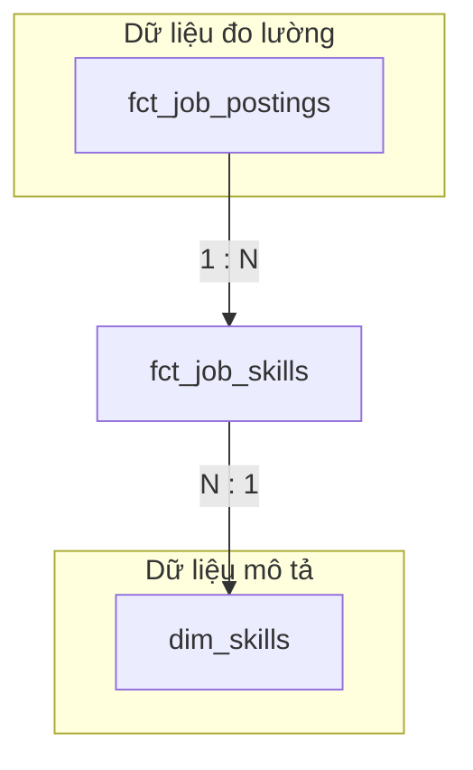

# 📖 Toàn Tập Dự Án: LinkedIn Job Analytics Pipeline

Bản hướng dẫn duy nhất này chứa đựng toàn bộ kiến thức, kiến trúc và quy trình vận hành từ con số 0 (From Scratch) cho đến khi hoàn thiện Dashboard.

---

## 🏗️ Chương 0: Thiết lập Hạ tầng Google Cloud (GCP Setup)

Trước khi đụng vào code, bạn cần chuẩn bị "mặt bằng" trên Google Cloud:

1.  **Tạo Project:** 
    - Truy cập [Google Cloud Console](https://console.cloud.google.com/).
    - Tạo một Project mới và ghi lại **Project ID** (Ví dụ: `linkedin-job-analytics-123`).
2.  **Kích hoạt (Enable) API:**
    - Tìm kiếm và kích hoạt 2 dịch vụ: **BigQuery API** và **Google Cloud Storage JSON API**.
3.  **Quy hoạch Vùng (Region):**
    - Chúng ta chọn **`asia-southeast1` (Singapore)** cho tất cả các dịch vụ (Bucket GCS và Dataset BigQuery). 
    - *Lý do:* Đây là vùng gần Việt Nam nhất, giúp tốc độ truyền dữ liệu nhanh và ổn định nhất.

---

## 🔑 Chương 1: Quản trị Danh tính & Chìa khóa (IAM & Keys)

Đây là bước quan trọng nhất để Code của bạn có thể "nói chuyện" được với Google Cloud:

1.  **Tạo Service Account:**
    - Vào mục `IAM & Admin` -> `Service Accounts`.
    - Tạo một tài khoản mới (Ví dụ: `pipeline-executor`).
2.  **Cấp quyền (Grant Roles):** 
    - Gán các quyền sau: **Storage Admin**, **BigQuery Admin**.
3.  **Tạo Chìa khóa (JSON Key):**
    - Vào tab `Keys` của Service Account vừa tạo -> `Add Key` -> `Create new key` -> Định dạng **JSON**.
    - Tải file về, đổi tên thành `application_default_credentials.json`.
    - **Quan trọng:** Lưu file này vào thư mục `gcp_keys/` trong dự án. (Thư mục này đã được bảo vệ bởi `.gitignore`).

---

## 💻 Chương 2: Cài đặt Môi trường Cục bộ (Local Environment)

1.  **Cài đặt Thư viện:** `pip install -r requirements.txt`.
2.  **Cấu hình Biến môi trường (.env):** 
    Sao chép `.env.example` thành `.env` và thiết lập:
    - `GCP_PROJECT_ID`: ID dự án Google Cloud của bạn.
    - `GCS_BUCKET_NAME`: Tên hồ chứa dữ liệu (Vd: `linkedin-analytics-lake`).
    - `BQ_RAW_DATASET`: Tên tầng dữ liệu thô (Vd: `linkedin_raw`).
    - `BQ_MARTS_DATASET`: Tên tầng sản phẩm cuối (Vd: `linkedin_marts`).

---

## 🏛️ Chương 3: Kiến Trúc Hệ Thống (Architecture)

Hệ thống được thiết kế theo mô hình **Lakehouse** hiện đại trên Google Cloud:


### Tại sao lại chọn cấu trúc này?
- **Data Lake (GCS):** Lưu trữ file thô (Parquet) cực kỳ rẻ tiền, làm "Bằng chứng gốc" để dự phòng 10-20 năm.
- **Data Warehouse (BigQuery):** Sử dụng sức mạnh hàng ngàn CPU ảo để truy vấn 1 tỷ dòng chỉ trong vài giây.
- **Parquet vs CSV:** Chúng ta chọn Parquet vì nó nén tốt hơn 70% (tiết kiệm tiền GCS) và lưu trữ theo cột (tăng tốc độ truy vấn trên BigQuery).

---

## 🗺️ 2. Mô Hình Dữ Liệu (Star Schema Design)

Dữ liệu tại lớp **Marts** được tổ chức theo mô hình Ngôi sao để tối ưu hóa việc truy vấn và báo cáo.

### Phân biệt Bảng Fact & Bảng Dimension
| Đặc điểm | Fact Table (Sự thật) 📈 | Dimension Table (Chiều) 🔍 |
| :--- | :--- | :--- |
| **Nội dung** | Chứa các con số, định lượng (lương, số lượng job). | Chứa thông tin mô tả, thuộc tính (tên công ty, kỹ năng). |
| **Ghi chú** | Ít thay đổi, nằm ở trung tâm. | Giúp cung cấp ngữ cảnh cho bảng Fact. |

### Danh sách 5 Bảng "Ngôi Sao" (Final Marts)
1. **`fct_job_postings`**: Bảng lõi (job_id, salary, applies, posted_date).
2. **`fct_job_skills`**: Bảng cầu nối (Bridge) nối giữa Job và Skill.
3. **`dim_companies`**: Thông tin công ty (name, size, industry).
4. **`dim_skills`**: Danh mục kỹ năng & Phân loại (Hard/Soft Skill).
5. **`dim_locations`**: Phân tích địa lý & Trạng thái Remote.

---

## 💡 3. Bí Kíp Tối Ưu Hiệu Năng (Optimization Tips)

Trong BigQuery, **"Quét ít dữ liệu = Trả ít tiền"**. Chúng ta áp dụng 2 quy tắc "vàng" sau:

### ✅ Lọc trước khi Join (Filtering before JOIN)
Khi cần tính toán lương trung bình theo năm hoặc theo kỹ năng, hãy ưu tiên các cột có **Partition** hoặc **ID** trực tiếp:
- **Lọc theo Năm:** Lọc `posted_date` trong năm 2026 trước khi Join để BigQuery chỉ quét đúng "ngăn" dữ liệu đó (Partition Pruning).
- **Lọc theo Skill:** Nếu đã biết `skill_id`, hãy dùng `WHERE skill_id = 123` ngay trên bảng Fact thay vì Join qua bảng Dim để tìm tên kỹ năng. Điều này giúp giảm khối lượng dữ liệu "shuffle" cực lớn.

## 💎 Chương 4: Giải mã Mối quan hệ Fact & Skills (Many-to-Many)

Đây là phần quan trọng nhất để giải quyết bài toán: **"Một Job có nhiều kỹ năng"**.

### Sơ đồ luồng (The Bridge Pattern)


### Tại sao không để Skill trực tiếp trong bảng Fact?
- Nếu để Skill dạng chuỗi (ví dụ: "Python, SQL, Java"), bạn không thể dùng SQL để `SUM` hay `AVG` theo từng kỹ năng.
- Nếu tách ra bảng cầu nối **`fct_job_skills`**, mỗi cặp (Job - Một kỹ năng) là một dòng. Điều này cho phép BigQuery đếm (COUNT) và lọc (FILTER) kỹ năng với tốc độ ánh sáng.

---

## 🛠️ Chương 5: dbt & Quy Trình Biến Đổi (The Production Flow)

Chúng ta sử dụng quy trình dbt 3 lớp tiêu chuẩn doanh nghiệp để đảm bảo dữ liệu luôn sạch, nhanh và rẻ:

1. **Lớp Staging (`stg_`)**: 
   - **Nhiệm vụ:** Ép kiểu dữ liệu, đổi tên cột và lọc bỏ dòng trống (job_id null).
   - **Mục tiêu:** Tạo ra phiên bản "sạch thô" của 11 bảng gốc.

2. **Lớp Intermediate (`int_`)**: 
   - **Nhiệm vụ:** Thực hiện các phép Join nặng (`Heavy Joins`) như gộp Skills, Industries vào Job. Nén dữ liệu Speciality vào Company.
   - **Mục tiêu:** Xử lý toàn bộ logic phức tạp trước khi đưa ra lớp sản phẩm.

3. **Lớp Marts (`fct_`, `dim_`)**: 
   - **Nhiệm vụ:** Tạo ra bảng Fact/Dimension cuối cùng cho BI. 
   - **Cơ chế Incremental:** Riêng bảng `fct_job_postings` được cấu hình **Incremental**. dbt sẽ chỉ nạp thêm dữ liệu mới dựa theo `posted_date`, giúp tiết kiệm 90% chi phí BigQuery.

---

## 🛡️ 5. Kiểm soát chất lượng (Advanced Data Quality)

Hệ thống được lập trình để tự động kiểm tra định kỳ thông qua lệnh `dbt test`:
- **Relationship:** Đảm bảo mọi tin tuyển dụng đều có công ty tương ứng (không mồ côi dữ liệu).
- **Accepted Values:** Chặn các loại hình công việc lạ (`work_type`) lọt vào báo cáo.
- **Outlier Check:** Tự động loại bỏ các mức lương vô lý (Lương < 0 hoặc > 1 triệu USD/tháng).

---

## 🚀 6. Hướng Dẫn Vận Hành (Operations)

Dự án hiện đã được tự động hóa hoàn toàn. Bạn có 2 cách để vận hành:

### Cách 1: Chạy tự động (Khuyên dùng)
Chỉ cần chạy đúng một lệnh duy nhất từ thư mục gốc:
```bash
uv run python main.py
```
*Script này sẽ tự động đọc mọi cấu hình từ .env và thực thi: Extract -> Load -> dbt Run -> dbt Test.*

### Cách 2: Chạy từng bước (Manual)
1.  **Extract:** `uv run python job-market-pipeline/scripts/extract.py`
2.  **Load:** `uv run python job-market-pipeline/scripts/load.py`
3.  **Transform (dbt):** `cd job-market-pipeline/dbt && uv run dbt run`

---

## 🛠️ 7. Thiết lập cho người mới (Setup Guide)

Nếu bạn chia sẻ dự án này cho đồng nghiệp, hãy hướng dẫn họ:
1.  **Cài đặt thư viện:** `pip install -r requirements.txt`
2.  **Cấu hình biến môi trường:** Sao chép `.env.example` thành `.env` và điền thông tin dự án GCP.
3.  **Xác thực GCP:** Đảm bảo file JSON Key đã nằm trong thư mục `gcp_keys/`.

---

## 📚 Chương 9: Từ điển Dữ liệu Chi tiết (Data Dictionary)

Dữ liệu được lấy từ bộ Dataset chuyên sâu của Kaggle: [LinkedIn Job Postings (2023-2024)](https://www.kaggle.com/datasets/arshkon/linkedin-job-postings).

### 11 Bảng dữ liệu gốc (Raw Tables):

| Tên bảng | Nội dung chính | Các cột quan trọng |
| :--- | :--- | :--- |
| **`postings`** | Dữ liệu lõi về tin đăng | `job_id`, `company_id`, `title`, `description`, `max_salary`, `applies`, `views`, `posted_date` |
| **`companies`** | Profile doanh nghiệp | `company_id`, `name`, `company_size`, `state`, `country`, `zip_code` |
| **`job_skills`** | Kỹ năng yêu cầu | `job_id`, `skill_abr` (Nối với bảng skills) |
| **`skills`** | Danh mục kỹ năng | `skill_abr`, `skill_name` |
| **`salaries`** | Chi tiết về lương | `salary_id`, `job_id`, `max_salary`, `med_salary`, `min_salary`, `pay_period` |
| **`industries`** | Tên các ngành nghề | `industry_id`, `industry_name` |
| **`job_industries`**| Nối Job với Ngành | `job_id`, `industry_id` |
| **`benefits`** | Phúc lợi công việc | `job_id`, `type` (Health insurance, 401k, v.v.) |
| **`employee_counts`**| Quy mô nhân sự theo TG | `company_id`, `employee_count`, `follower_count`, `time_recorded` |
| **`comp_specialities`**| Chuyên môn công ty | `company_id`, `speciality` |
| **`comp_industries`**| Ngành nghề công ty | `company_id`, `industry` |

---

## 🔄 Chương 11: Vòng đời Dự án & Quản trị Vận hành

Hệ thống được thiết kế để dễ dàng mở rộng và phục hồi trước các biến cố dữ liệu.

### 1. Quy trình nạp dữ liệu mới (Incremental Run)
Khi có file CSV mới từ Kaggle hoặc nguồn khác:
1.  Chép file vào thư mục tương ứng trong `data/raw/`.
2.  Chạy `python main.py`.
3.  **Cơ chế nhận diện cũ/mới:**
    - **Lớp dbt:** Sử dụng lệnh `where posted_date > (select max(posted_date) from {{ this }})`. dbt sẽ tự động nhìn vào bảng hiện tại để tìm ngày đăng tin mới nhất và chỉ nạp thêm phần dữ liệu sau ngày đó.
    - **Chống trùng lặp:** Nhờ cấu hình `unique_key = 'job_id'`, nếu một tin đăng bị nạp lại lần 2, dbt sẽ ghi đè (Update) thay vì tạo ra dòng mới.

### 2. Thay đổi Logic hoặc có Yêu cầu mới (Refactoring)
Khi sếp yêu cầu thêm một cột mới hoặc thay đổi cách tính lương:
1.  Cập nhật file `.sql` tương ứng trong dbt (lớp `stg_` hoặc `int_`).
2.  Chạy: `dbt run --full-refresh --select [ten_model]`.
3.  dbt sẽ tính toán lại toàn bộ dữ liệu lịch sử để bảng Marts luôn cập nhật logic mới nhất.

### 3. Xử lý thiếu hụt dữ liệu quá khứ (Backfill)
Nếu phát hiện dữ liệu tháng 12/2023 bị thiếu trên BigQuery nhưng có trên máy:
1.  Chỉ cần bỏ file CSV tháng 12/2023 vào `data/raw/`.
2.  Chạy lại Pipeline. Cơ chế `unique_key` của dbt sẽ tự động "vá" lỗ hổng này mà không làm trùng dữ liệu hiện tại.

### 4. Phục hồi dữ liệu (Data Recovery)
Nếu lỡ tay xóa Dataset trên BigQuery:
1.  **Đừng hoảng sợ!** Dữ liệu Parquet của bạn vẫn an toàn trên GCS (Data Lake).
2.  Chạy lệnh `python job-market-pipeline/scripts/load.py`.
3.  Toàn bộ các bảng `raw` sẽ được tái tạo từ GCS chỉ trong vài phút.

---

## 📁 Chương 12: Cấu Trúc Thư Mục (Folder Structure)

```text
📁 linkedln-job-posting
├── 📄 main.py (Điều phối toàn bộ dự án)
├── 📄 requirements.txt (Thư viện cần thiết)
├── 📄 .env.example (File cấu hình mẫu)
├── 📁 data (Dữ liệu raw/ và processed/)
├── 📁 gcp_keys (Chìa khóa Google Cloud)
└── 📁 job-market-pipeline
    ├── 📁 scripts (Mã nguồn Python)
    └── 📁 dbt (Logic SQL & Star Schema)
```
